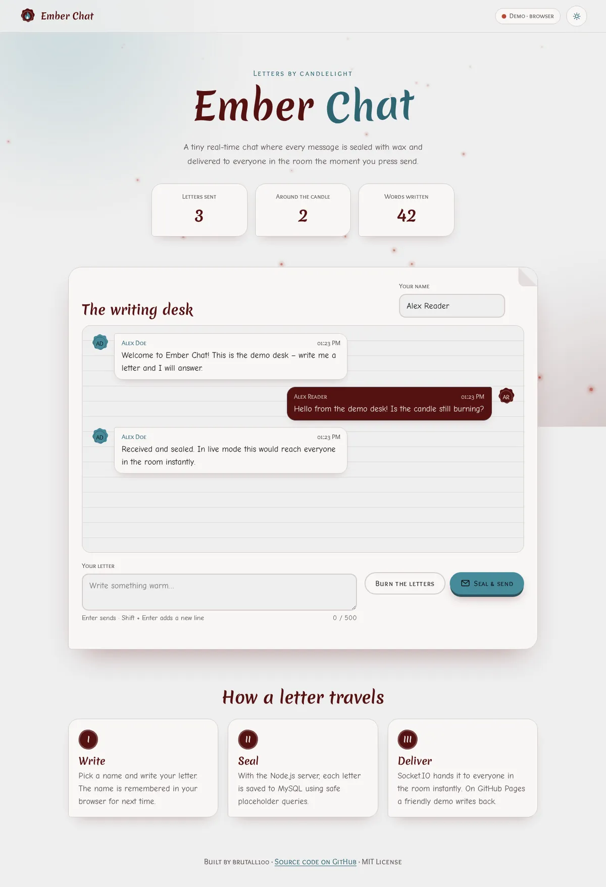
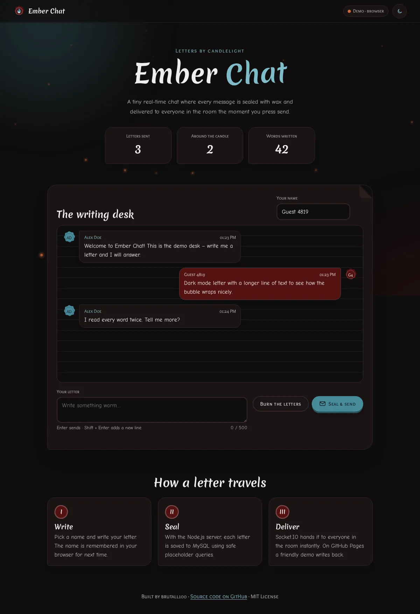
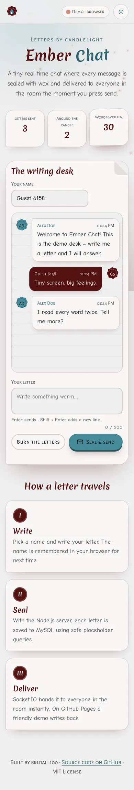

# Ember Chat

**A real-time chat where every message arrives like a letter sealed with wax.**

🇬🇧 English · [🇱🇹 Lietuviškai](README.lt.md)

**[▶ Live demo](https://brutall100.github.io/ember-chat/)** · **[Source code](https://github.com/brutall100/ember-chat)**



<p>
  
  
</p>

---

## About

Ember Chat started as my first attempt to understand how a chat app works: a form, a
Node.js server and a MySQL table. In version 2 I turned it into a small, real product:

- With the **Node.js server**, letters travel between everyone in the room in real time
  (Socket.IO) and are stored in **MySQL**.
- On **GitHub Pages** there is no server, so the page switches to a **demo mode**:
  letters are kept in your browser (localStorage) and a made-up pen pal, *Alex Doe*,
  writes back.

The page decides which mode to use by itself. You don't need to change any settings.

## Features

- 💬 **Real-time chat** with Socket.IO. Open two tabs and watch letters fly between them.
- 🗄️ **Message history in MySQL**, saved with placeholder (`?`) queries so user text can't change the SQL.
- 🧪 **Demo mode** for GitHub Pages: browser storage plus an auto-reply pen pal.
- 🔏 **Wax-seal avatars** drawn in SVG from each author's initials. No photos.
- 🕯️ **Living background** with drifting candle glows and rising embers. It animates only `transform` and `opacity`.
- 🌗 **Light and dark themes**: follows your system setting, remembers your choice, and never flashes on load.
- 🔢 **Counters that count up**: letters sent, people online, words written.
- ✉️ **Micro-interactions**: buttons lift and press, a ripple effect, an envelope that flies off when you send, cards that rise on hover, sections that appear as you scroll.
- ♿ **Accessible**: skip link, visible `:focus-visible`, labelled fields, `aria-live` messages, WCAG-checked contrast, and `prefers-reduced-motion` support.
- 📱 **Responsive** down to 390 px with no sideways scrolling.

## Built with

| Layer | Tech |
|---|---|
| Front end | HTML, CSS (custom properties), vanilla JavaScript |
| Server | Node.js, Express, Socket.IO |
| Database | MySQL / MariaDB (`mysql2`) |
| Config | `dotenv` (environment variables) |

### Palette

| Token | HEX | Used for |
|---|---|---|
| `--ink` | `#0F0E0E` | Dark background, light-mode text, text on teal buttons |
| `--wine` | `#541212` | Wax seals, your own letters, light-mode headings |
| `--teal` | `#468A9A` | Buttons, focus rings, glow |
| `--mist` | `#EEEEEE` | Light background, dark-mode text |
| `--accent-text` | `#2F6573` / `#7FBCCA` | Teal made readable as text (light / dark) |

All contrast pairs were checked: body text is at least **5.6 : 1** and UI parts at least **3.38 : 1**.

### Fonts (Google Fonts)

- **Merienda** – headings (feels hand-written, like a letter)
- **Comic Neue** – body text and messages
- **Overlock SC** – labels, buttons and small caps

## What I learned

- How **WebSockets** (Socket.IO) push data to every client at once, and how that differs from a plain `fetch` POST.
- Why SQL must use **placeholders** instead of string concatenation.
- Keeping secrets in **environment variables** and out of git (`.env` + `.gitignore`).
- Designing one app that runs in **two modes**: a real server and a static demo.
- Building a whole theme from **CSS custom properties**, including a dark mode with no flash.
- Checking **colour contrast** with real numbers, not by eye.

## Run it locally

You need **Node.js 18+**. MySQL is optional.

```bash
git clone https://github.com/brutall100/ember-chat.git
cd ember-chat
npm install
cp .env.example .env      # then edit .env with your own values
npm start                 # http://localhost:3000
```

**With MySQL:** create a database and a user (see `sql/schema.sql`) and fill in the
`DB_*` values in `.env`. The server creates the `messages` table itself.

**Without MySQL:** leave `DB_HOST` empty. The server keeps messages in memory until you restart it.

**Demo mode only:** open `index.html` through any static server (for example
`npx serve .`). Without the Node server, the page switches to demo mode.

| Mode | How to start | Where messages are kept |
|---|---|---|
| Live + MySQL | `npm start` with `DB_*` set | MySQL table `messages` |
| Live + memory | `npm start`, empty `DB_HOST` | Server memory |
| Demo | GitHub Pages / any static server | Your browser (localStorage) |

## Project structure

```
ember-chat/
├── index.html            # page markup
├── css/
│   └── styles.css        # all styles; palette in :root
├── js/
│   ├── theme.js          # applies the saved theme before paint (no flash)
│   ├── runtime-config.js # "demo" on Pages; the server answers "live"
│   └── app.js            # chat logic, demo mode, animations
├── images/
│   └── favicon.svg       # wax-seal icon in the palette colours
├── docs/                 # screenshots (WebP)
├── sql/
│   └── schema.sql        # MySQL table
├── server.js             # Express + Socket.IO + MySQL
├── .env.example          # sample environment variables
└── package.json
```

## Credits

- Real-time idea inspired by the official [Socket.IO chat tutorial](https://socket.io/get-started/chat).
- Fonts: [Merienda](https://fonts.google.com/specimen/Merienda), [Comic Neue](https://fonts.google.com/specimen/Comic+Neue), [Overlock SC](https://fonts.google.com/specimen/Overlock+SC) via Google Fonts.
- “Alex Doe” is a made-up demo character.

## License

[MIT](LICENSE) © 2023 brutall100
